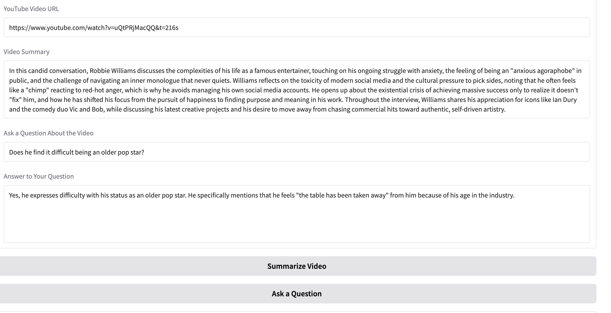

# youtube-summarizer-qa-tool
AI-Powered YouTube Summarizer, QA Tool with RAG, LangChain, FAISS

## Background

In this project, I created an interactive Agent that summarizes Youtube videos and answers questions about the video.

## Libraries and technologies used

* gradio: Web interface to interact with the agent
* youtube_transcript_api: Used to extract the transcript of the Youtube video
* langchain: Used for text splitting and creating the rag pipeline
* FAISS: used for the vectorstore and Retriever in the RAG pipeline
* Embeddings: I use OpenAI'S `text-embedding-3-large` model for the text embeddings
* Chatbot: I used Google's `gemini-3.1-flash-lite-preview` model

## Setup

Create a config.py file containing your Openai and Google API keys

GOOGLE_API_KEY = ''
OPENAI_API_KEY = ''

```
conda create -n youtubebot
conda activate youtubebot
pip install -r requirements.txt
python3 ytbot.py
```




